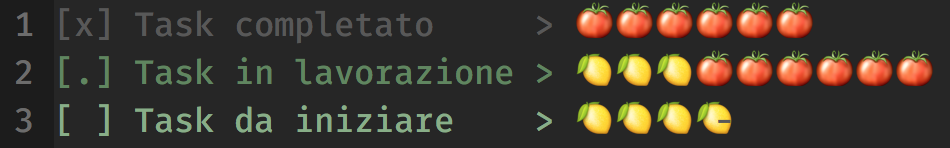
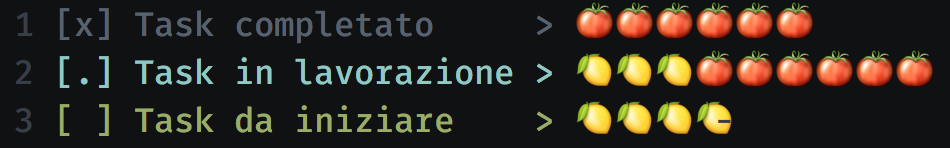
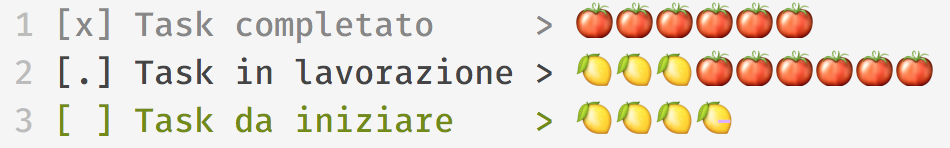
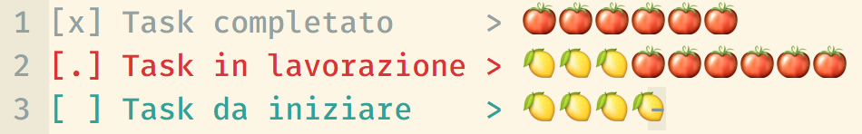

# vimt0d0 -	Vim syntax highlighting for TODO lists, à-la Orgmode

vimt0d0 is a simple syntax highlighting for TODO lists, with a mix of Orgmode-like syntax and support for "pomodoro"-like micromanagement.

## Screenshots

From top to bottom: Apprentice, Crayon, Papercolor, Solarized.

## Usage

This syntax highlighting supports three different formats for todo
entries:

        [x] Completed Task         > 🍅 🍅 🍅 🍅 🍅 🍅
        [.] Task in progress       > 🍋 🍋 🍋 🍅 🍅 🍅 🍅 🍅 🍅
        [ ] Task yet to be started > 🍋 🍋 🍋 🍋

It uses `String`, `Special` and `Comment` syntax definitions, so it works
with almost any colorscheme.

### Pomodori

I use two icons to distinguish planned pomodori and done pomodori. I'll use the term "lemons" to identify planned (and still not worked) pomodori. Ideally, the workflow is to plan lemons at the beginning of the day, then convert them into pomodori while you work.

Here are the available commands (with respective mappings):

* `<Leader>ts` setup row: adds a `>` marker at the end of the current todo, unless already present (mnemonic: todo setup)
* `<Leader>tS` setup rows: adds a `>` marker at the end of each todo, unless already present (mnemonic: todo Setup)
* `<Leader>tp` add pomodoro: adds a 🍅  to current task (mnemonic: todo pomodoro)
* `<Leader>tP` remove pomodoro: removes a 🍅  from current task (mnemonic: todo Pomodoro)
* `<Leader>tl` add lemon: adds a 🍋  to current task (mnemonic: todo lemon)
* `<Leader>tL` remove lemon: removes a 🍋  from current task (mnemonic: todo Lemon)
* `<Leader>td` do pomodoro: converts a 🍋  into a 🍅  in current task (mnemonic: todo do)

If you also use (and you should) the [vim-easy-align](https://github.com/junegunn/vim-easy-align) plugin, you can align the `>` markers with `:EasyAlign />/`.

### Comments

It also supports commenting ( `#` char to the end of line) and highlights the
following words in comments: TODO, FIXME, XXX, NOTE, WTF, and ???.

### Filetype

It automatically works with .t0d0 files. If you want to try it on another
file, choose this syntax with

        :set filetype=vimt0d0

### Installing

You can use this plugin with any `vim-plug` like plugin manager. Just add something like

        Plug 'metalelf0/vimt0d0'

to your vimrc.
